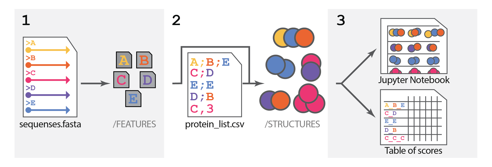
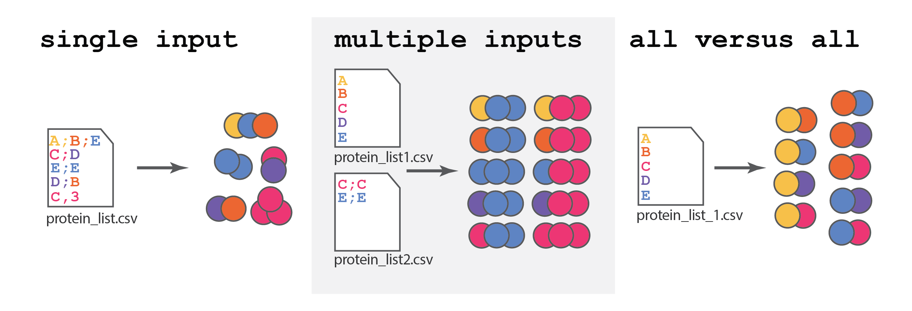

# AlphaPulldown Manual

`version 2.0 (beta)`

> AlphaPulldown fully **maintains backward compatibility** with input files and scripts from versions 1.x. For instructions on using older files and scripts, please refer to the sections marked "Older Version".

## About AlphaPulldown

AlphaPulldown is an implementation of [AlphaFold-Multimer](https://github.com/google-deepmind/alphafold) designed for customizable high-throughput screening of protein-protein interactions. Besides, AlphaPulldown provides additional customizations of the AlphaFold which include custom structural multimeric templates (TrueMultimer), MMseqs2 multiple sequence alignment (MSA) and [ColabFold](https://github.com/sokrypton/ColabFold) databases, protein fragment predictions, and implementation of cross-link mass spec data using [AlphaLink2](https://github.com/Rappsilber-Laboratory/AlphaLink2/tree/main).

<picture>
  <source media="(prefers-color-scheme: dark)" srcset="../manuals/AP_pipeline_dark.png">
  <source media="(prefers-color-scheme: light)" srcset="../manuals/AP_pipeline.png">
  
</picture>
 
The original AlphaFold-Multimer protein complex prediction pipeline may be split into two main steps: **(1)** the databases search step that generates Features and MSA for every individual protein sequence and **(2)** protein complex structure prediction itself. AlphaPluldown executes these steps as independent scripts which is more suitable for modeling a large number of protein complexes. Additionally, **(3)** AlphaPluldown provides two options for the downstream analysis of the resulting protein models.


<picture>
  <source media="(prefers-color-scheme: dark)" srcset="../manuals/AP_modes_dark.png">
  <source media="(prefers-color-scheme: light)" srcset="../manuals/AP_modes.png">
  
</picture>

A key strength of AlphaPulldown is its ability to flexibly define how proteins are combined for structure prediction of protein complexes. Here are the three main approaches you can use:

* **Single file**: Create a file where each row lists the protein sequences you want to predict together.
* **Multiple Files**: Provide several files, each containing protein sequences. AlphaPulldown will automatically generate all possible combinations by pairing rows of protein names from each file.
* **All versus all**: AlphaPulldown will generate all possible non-redundant combinations of proteins in the list. 

AlphaPulldown work pipeline is the following:

1) **Features and MSA**: At this step for every queried protein sequence AlphaFold searches for preinstalled databases using HMMER and calculates multiple sequence alignment (MSA) for all finden homologues. Additionally, AlphaFold searches for homolog structures that will be used as templates for features generation. This step requires only CPU to run.<be>
There are a few customizable options for this step:

   * To speed up the search process MMSeq2 ${\color{red} [add link]}$ instead of HHMER can be used.<br>
   * Use custom MSA ${\color{red} [add link]}$.
   * _NEW:_ Use a custom structural template ${\color{red} [add link]}$. Including a multimeric one (TrueMultimer mode).
  

2) **Structure prediction**: At this step, the AlaphaFold neural network runs and produces the final protein structure, which requires GPU computational powers.
   Here, AlphaPulldown allows:
   * Read all combinations of proteins to predict from one file or generate combinations of proteins using `pulldown` or `all_versus_all` modes.
   * Specify the number of residues that correspond to the part of the protein you want to predict.
   * Adjust MSA depth (allows control over how much the initial MSA influences the final model).
   * Crosslinking data implementation with [AlphaLink2](https://github.com/Rappsilber-Laboratory/AlphaLink2/tree/main).

3) **Results analysis**: The results for all predicted models could be systematized using one of the following options:
   * Table that contains various scores and physical parameters of protein complexes' interaction.
   * Jupyter notebook with interactive 3D models and PAE plots.
<br>

## Installation

0. #### Alphafold databases

   For the standard MSA and features calculation, AlphaPulldow requires Genetic databases. Check if you have downloaded necessary parameters and databases (e.g. BFD, MGnify etc.) as instructed in [AlphFold's documentation](https://github.com/deepmind/alphafold). You should have a directory like below:

   <details>
   <summary><b>
   Databases directory
   </b></summary>
   
    ```
    alphafold_database/                             # Total: ~ 2.2 TB (download: 438 GB)
       bfd/                                   # ~ 1.7 TB (download: 271.6 GB)
           # 6 files.
       mgnify/                                # ~ 64 GB (download: 32.9 GB)
           mgy_clusters_2018_12.fa
       params/                                # ~ 3.5 GB (download: 3.5 GB)
           # 5 CASP14 models,
           # 5 pTM models,
           # 5 AlphaFold-Multimer models,
           # LICENSE,
           # = 16 files.
       pdb70/                                 # ~ 56 GB (download: 19.5 GB)
           # 9 files.
       pdb_mmcif/                             # ~ 206 GB (download: 46 GB)
           mmcif_files/
               # About 180,000 .cif files.
           obsolete.dat
       pdb_seqres/                            # ~ 0.2 GB (download: 0.2 GB)
           pdb_seqres.txt
       small_bfd/                             # ~ 17 GB (download: 9.6 GB)
           bfd-first_non_consensus_sequences.fasta
       uniclust30/                            # ~ 86 GB (download: 24.9 GB)
           uniclust30_2018_08/
               # 13 files.
       uniprot/                               # ~ 98.3 GB (download: 49 GB)
           uniprot.fasta
       uniref90/                              # ~ 58 GB (download: 29.7 GB)
           uniref90.fasta
    ```
   </details>
   
   > Note: Since the local installation of all genetic databases is space-consuming, you can alternatively use the remotely-run MMseqs2 and ColabFold databases ${\color{red} [add\ link]}$.

1. #### Create Anaconda environment

   **Firstly**, install [Anaconda](https://www.anaconda.com/) and create AlphaPulldown environment, gathering necessary dependencies 
   ```bash
   conda create -n AlphaPulldown -c omnia -c bioconda -c conda-forge python==3.10 openmm==8.0 pdbfixer==1.9 kalign2 cctbx-base pytest importlib_metadata hhsuite
   ```
   
   **Optionally**, if you do not have it yet on your system, install [HMMER](http://hmmer.org/documentation.html) from Anaconda
   ```bash
   source activate AlphaPulldown
   conda install -c bioconda hmmer
   ```
   This usually works, but on some compute systems users may wish to use other versions or optimized builds of already installed HMMER and HH-suite.

2. #### Installation using pip

   Activate the AlphaPulldown environment and install AlphaPulldown
   ```bash
   source activate AlphaPulldown
   
   python3 -m pip install alphapulldown==1.0.4
   pip install jax==0.4.23 jaxlib==0.4.23+cuda11.cudnn86 -f https://storage.googleapis.com/jax-releases/jax_cuda_releases.html
   ```
   
   >**For older versions of AlphaFold**
   >
   >If you haven't updated your databases according to the requirements of AlphaFold 2.3.0, you can still use AlphaPulldown with your older version of AlphaFold database. Please follow the installation instructions on the [dedicated branch](https://github.com/KosinskiLab/AlphaPulldown/tree/AlphaFold-2.2.0).

   ### Installation for developers
   <details>
   
   <summary><b>
    Instructions
   </b></summary>

    1. Clone the GitHub repo
        ```
        git clone --recurse-submodules git@github.com:KosinskiLab/AlphaPulldown.git
        cd AlphaPulldown 
        git submodule init
        git submodule update 
        ```
    2. Create the Conda environment as described in [https://github.com/KosinskiLab/AlphaPulldown/blob/installation-intro-update/README.md#create-anaconda-environment](https://github.com/KosinskiLab/AlphaPulldown/tree/main?tab=readme-ov-file#create-anaconda-environment) 
    3. Add AlphaPulldown package and its submodules to the Conda environment
        ```
        source activate AlphaPulldown
        cd AlphaPulldown
        pip install .
        pip install -e alphapulldown/ColabFold --no-deps
        pip install -e alphafold --no-deps
        ```
        You need to do it only once.
    4. When you want to develop, activate the environment, modify files, and the changes should be automatically recognized.
    5. Test your package during development using tests in ```test/```, e.g.:
       ```
       pip install pytest
       pytest -s test/
       pytest -s test/test_predictions_slurm.py
       pytest -s test/test_features_with_templates.py::TestCreateIndividualFeaturesWithTemplates::test_1a_run_features_generation
       ```
    5. Before pushing to the remote or submitting pull request
        ```
        pip install .
        pytest -s test/
        ```
        to install the package and test. Pytest for predictions only work if slurm is available. Check the created log files in your current directory.
        
        
       </details>
       
<br>

## 1. Compute multiple sequence alignment (MSA) and template features (CPU stage)
### 1.1. Basic run
At this step, you need to provide a [protein FASTA format](https://www.ncbi.nlm.nih.gov/WebSub/html/help/protein.html) file with all protein sequences that will be used for complexes prediction.
   ```
   >protein_A
   SEQUENCEOFPROTEINA
   >protein_B
   SEQUENCEOFPROTEINB
   ```

Then activate the AlphaPulldown environment and run script `create_individual_features.py` as follows:

   ```bash
   source activate AlphaPulldown
   ```
   ```bash
   create_individual_features.py \
     --fasta_paths=<sequences.fasta> \
     --data_dir=<path to alphafold databases> \
     --output_dir=<dir to save the output objects> \ 
     --max_template_date=<any date you want, format like: 2050-01-01> \
   ```
* Instead of `<sequences.fasta>` provide a path to your input fasta file. <br>
* Instead of `<path to alphafold databases>` provide a path to the genetic database (see [0. Alphafold-databases](#installation) of the installation part).<br>
* Instead of `<dir to save the output objects>` provide a path to the output directory, where your features files will be saved. <br>
* A date in the flag `--max_template_date` is needed to restrict the search of protein structures that are deposited before the indicated date. Unless the date is later than the date of your local genomic database's last update, the script will search for templates among all available structures.

The result of ```create_individual_features.py``` run is pickle format features for each protein from the input fasta file (e.g. `sequence_name_A.pkl` and `sequence_name_B.pkl`) stored in the ```output_dir```. 
> [!NOTE]
> The name of the pickles will be the same as the descriptions of the sequences  in fasta files (e.g. `>prtoein_A` in the fasta file will yield `protein_A.pkl`). Note that special symbols such as ```| : ; #```, after ```>``` will be replaced with ```_```. 

Go to the next step [2.1. Basic run](#2-predict-structures-gpu-stage).

### 1.2. FLAGS

Features calculation script ```create_individual_features.py``` has several optional FLAGS:
* `--save_msa_files`
   By default is **False** to save storage stage but can be changed into **True**. If it is set to ```True```, the programme will 
   create individual folder for each protein. The output directory will look like:
   
   ```
    output_dir
         |- protein_A.pkl
         |- protein_A
               |- uniref90_hits.sto
               |- pdb_hits.sto
               |- etc.
         |- protein_B.pkl
         |- protein_B
               |- uniref90_hits.sto
               |- pdb_hits.sto
               |- etc.
   ```
    
    
   If ```save_msa_files=False``` then the ```output_dir``` will look like:
   
   ```
    output_dir
         |- protein_A.pkl
         |- protein_B.pkl
   ```

 

 * `--use_precomputed_msas`
   Default value is ```False```. However, if you have already had msa files for your proteins, please set the parameter to be True and arrange your msa files in the format as below:
   
   ```
    example_directory
         |- protein_A 
               |- uniref90_hits.sto
               |- pdb_hits.sto
               |-***.a3m
               |- etc
         |- protein_B
               |- ***.sto
               |- etc
   ```
   
   Then, in the command line, set the ```output_dir=/path/to/example_directory```

* `--skip_existing`

  Default is ```False``` but if you have run the 1st step already for some proteins and now add new proteins to the list, you can change ```skip_existing``` to ```True``` in the
  command line to avoid rerunning the same procedure for the previously calculated proteins.

* `--seq_index`
   
   Default is `None` and the program will run predictions one by one in the given files. However, you can set ```seq_index``` to 
   different number if you wish to run an array of jobs in parallel then the program will only run the corresponding job specified by the ```seq_index```. e.g. the programme only calculate features for the 1st protein in your fasta file if ```seq_index``` is set to be 1. See also the Slurm sbatch script above for example how to use it for parallel execution.
   
   :exclamation: ```seq_index``` starts from 1.
* `--use_mmseqs2`
  
  Use mmseqs2 remotely or not. 'true' or 'false', default is 'false' ${\color{red} [add\ description]}$

 <details>
   
   <summary>
   Flags related to TrueMultimer mode:
   </summary>

* `--path_to_mmt`
  
  Path to directory with multimeric template mmCIF files". ${\color{red} [add\ description]}$
  
* `--description_file`
  
  Path to the text file with descriptions. ${\color{red} [add\ description]}$

* `--threshold_clashes`
  
  Threshold for VDW overlap to identify clashes. The VDW overlap between two atoms is defined as the sum of their VDW radii minus the distance between their centers.
  If the overlap exceeds this threshold, the two atoms are considered to be clashing.
  A positive threshold is how far the VDW surfaces are allowed to interpenetrate before considering the atoms to be clashing.
  (default: 1000, i.e. no threshold, for thresholding, use 0.6-0.9)
  
* `--hb_allowance`
  
  Additional allowance for hydrogen bonding (default: 0.4) ${\color{red} [add\ description]}$

* `--plddt_threshold`
  
  Threshold for pLDDT score (default: 0)
 </details>

### 1.3. Run using MMseqs2 and ColabFold databases (faster):
MMseq2 is another method for homologs search and MSA generation. It offers an alternative to the default HMMer and HHblits used by AlphaFold. The results of these different approaches might lead to slightly different protein structure predictions due to the variations in the captured evolutionary information within the MSAs. AlphaPulldown supports the implementation of MMseq2 search made by ColabFold, which also provides a web server for MSA generation, so no local installation of databases is needed.
>If you used mmseqs2 please remember to cite: 
Mirdita M, Schütze K, Moriwaki Y, Heo L, Ovchinnikov S and Steinegger M. ColabFold: Making protein folding accessible to all.
Nature Methods (2022) doi: 10.1038/s41592-022-01488-1

#### Run MMseqs2 remotely 

>[!Caution]
>To avoid overloading the remote server, do not submit a large number of jobs at the same time. If you want to calculate MSAs for many sequences, please use  [mmseqs2 locally](#run-mmseqs2-locally)

Same as for [1.1 Basic](#11-basic-run) run to run `create_individual_features.py` just add `--use_mmseqs2=True` FALG:
```bash
source activate AlphaPulldown
create_individual_features.py \
  --fasta_paths=example_1_sequences.fasta \
  --data_dir=<path to alphafold databases> \
  --output_dir=<dir to save the output objects> \ 
  --use_mmseqs2=True \
  --max_template_date=<any date you want, format like: 2050-01-01> \ 

```

After the script run is finished, your output_dir will look like this:
```bash
output_dir
    |-protein_A.a3m
    |-protein_A_env/
    |-protein_A.pkl
    |-protein_B.a3m
    |-protein_B_env/
    |-protein_B.pkl
    ...
```
Go to the next step [2.1. Basic run](#2-predict-structures-gpu-stage)

#### Run mmseqs2 locally 

AlphaPulldown does **NOT** provide interface or codes that will run mmseqs2 locally. Neither will it install mmseqs or any other programme required. The user has to
install mmseqs, colabfold databases, colab_search and other required dependencies and run msa alignments first. An example guide can be found on [Colabfold github](https://github.com/sokrypton/ColabFold).

Suppose you have run mmseqs locally successfully using ```colab_search``` programme, for each protein of your interest, it will generate an a3m file. Thus, your output_dir
should look like this:

```
output_dir
    |-0.a3m
    |-1.a3m
    |-2.a3m
    |-3.a3m
    ...
```
These a3m files from```colabfold_search``` are named in such inconvenient way. Thus, we have provided a ```rename_colab_search_a3m.py``` script that will help you rename all these files. Simply run:

```bash
# within the same conda env where you have installed AlphaPulldown
cd output_dir
rename_colab_search_a3m.py
```
Then your ```output_dir``` will become:

```
output_dir
    |-protein_A.a3m
    |-protein_B.a3m
    |-protein_C.a3m
    |-protein_D.a3m
    ...
```
where ```protein_A``` ```protein_B``` ... correspond to the names you have in your input fasta file (">protein_A" will give you "protein_A.a3m", "protein_B" -> "protein_B.a3m" etc.). 
After this, go back to your project directory with the original FASTA file and point to this directory in the command:

```bash
source activate AlphaPulldown
create_individual_features.py \
  --fasta_paths=example_1_sequences.fasta \
  --data_dir=<path to alphafold databases> \
  --output_dir=output_dir \ 
  --skip_existing=False \
  --use_mmseqs2=True \
  --seq_index=<any number you want or skip the flag to run all one after another>
```

and AlphaPulldown will automatically search each protein's corresponding a3m files. In the end, your output_dir will look like:

```
output_dir
    |-protein_A.a3m
    |-protein_A.pkl
    |-protein_B.a3m
    |-protein_B.pkl
    |-protein_C.a3m
    |-protein_C.pkl
    ...
```
Go to the next step [2.1. Basic run](#2-predict-structures-gpu-stage)

### 1.4 Run with custom templates (TrueMultimer)
Instead of using the default search through the PDB database for structural templates, you can provide a custom database. AlphaPulldown supports a feature called "True Multimer," which allows AlphaFold to use multi-chain structural templates during the prediction process. This can be beneficial for protein complexes where the arrangement of the chains may vary. True Multimer mode will arrange different complex subunits as in the template.  

1. **Prepare a FASTA File:** Create a FASTA file containing all protein sequences that will be used for predictions as outlined in [1.1 Basic run](#11-basic-run).
   ${\color{red} remove\ all\ special\ symbols \from \fasta}$
3. **Create a Template Directory:** Designate a folder (e.g., "templates") to store your custom template files in PDB or CIF format.
4. **Create a description file:** This `description.csv` file links protein sequences to templates:

```
>protein_A,TMPL.cif,A
>protein_B,TMPL.cif,B
```

   * **Column 1** (>protein_A): Must exactly match protein descriptions from your FASTA file. 
   * **Column 2** (TMPL.cif): The filename of your template structure in PDB or CIF format.
   * **Column 3** (A): The chain ID within the template that the query sequence corresponds to.
     
**For Multiple Templates:**  If you want to provide multiple templates for a single protein, add additional rows with the same protein name but different templates and chain IDs:
```
>protein_A,TMPL.cif,A
>protein_A,TMP2.cif,B
>protein_B,TMPL.cif,B
```

>[!Note]
>Your template will be renamed to a PDB code taken from *_entry_id*. If you use a *.pdb file instead of *.cif, AlphaPulldown will first try to parse the PDB code from the file. Then it will check if the filename is 4-letter long. If it is not, it will generate a random 4-letter code and use it as the PDB code.

Now run:

```bash
  create_individual_features.py \
    --fasta_paths=<sequences.fasta> \
    --path_to_mmt=<path to template directory>/ \
    --description_file=<description.csv> \
    --data_dir=<path to alphafold databases> \
    --output_dir=<dir to save the output objects> \ 
    --max_template_date=<any date you want, format like: 2050-01-01> \
    --save_msa_files=True \
    --use_precomputed_msas=True \
    --skip_existing=True
```
Output: Pickle format features for each protein in the `description.csv` file stored in the ```output_dir```. 
${\color{red}Add\ True\ Multimer\ limitations}$ 

Go to the next step [2.X. Template run](#2-predict-structures-gpu-stage) ${\color{red}Correct}$ 

For additional Flags of TrueMultimer mode run refer to [FLAGS](#12-flags)

### 1.5 Older versions
If you are updating from previous versions of AlphaPulldown, and the local databases have not changed, there's no change to how features are generated. Input files and scripts from previous versions will work without modification in the current version.
${\color{red} Correct\ if\ there\ are\ any\ changes}$


## 2. Predict structures (GPU stage)
### 2.1 Basic run
This step requires the pickle files (.pkl) generated during the [first stage](#1-compute-multiple-sequence-alignment-msa-and-template-features-cpu-stage).
Additionally, you'll need to provide a list of protein combinations you intend to predict.

#### Protein Combinations File
Here's how to structure your combinations file `protein_list.txt`, with explanations:

**Prediction of monomers**:
  ```
  protein_A
  protein_B
  protein_C,1-100  
  ```
  * Each line is a separate prediction
  * Lines like `protein_A` will trigger a prediction of the entire sequence.
  * To predict specific residue ranges (e.g., the first 100 residues of protein_C), use the format "protein_C,1-100".

 **Prediction of complexes**:
   ```
   protein_A;protein_B;protein_C
   protein_B;protein_B 
   protein_B,4
   protein_C,2;protein_A
   protein_A,4,1-100;protein_B
   ```
   * Use semicolons (`;`) to separate protein names within a complex.
   * Instead of repeating the protein name for homooligomers, specify the number of copies after the protein's name (e.g., `protein_B,4` for a tetramer).
   * Combine residue ranges and homooligomer notation for specific predictions (e.g., `protein_A,4,1-100;protein_B`).

#### Running Structure Prediction
To predict structures, activate the AlphaPulldown environment and run the script `run_multimer_jobs.py` as follows:
 ```bash
 source activate AlphaPulldown
 ```
```bash
run_multimer_jobs.py \
  --mode=custom \
  --monomer_objects_dir=<dir that stores feature pickle files> \ 
  --protein_lists=<protein_list.txt> \
  --output_path=<path to output directory> \ 
  --num_cycle=<any number e.g. 3> 
```
$\textrm{\color{red}Do we need to specify data dir?}$
$\textrm{\color{red}Can we delete custom mode here?}$

Explanation of arguments:
* Instead of `<dir that stores feature pickle files>` provide the path to the directory containing the `.pkl` feature files generated in the previous step.
* Instead of `<protein_list.txt>` provide the path to a text file containing a list of protein combinations to be modeled.
* Instead of `<path to output directory>` provide the path where subdirectories containing the final structures will be saved.
* `--num_cycle` This flag specifies the number of times the AlphaFold neural network will run, using the output of one cycle as input for the next. Increasing this number may improve the quality of the final structures (especially for large complexes), but it will also increase the runtime.

#### Output

The `run_multimer_jobs.py` script generates a set of directories for each specified protein complex.
Full structure of the output directories is the following:
```
<complex_name>/
    <complex_name>_ranked_{0,1,2,3,4}.png
    ranked_{0,1,2,3,4}.pdb
    ranking_debug.json
    result_model_{1,2,3,4,5}_*.pkl
    timings.json
    unrelaxed_model_{1,2,3,4,5}_*.pdb
```
Please refer to the [AlphaFold manual](https://github.com/google-deepmind/alphafold) for more details on output files.

**Key files**:
* `ranked_{0,1,2,3,4}.pdb`: Structure files ranked from best to worst predicted quality.
*  `<complex_name>_ranked_{0,1,2,3,4}.png`: Plots of predicted aligned errors (PAE) providing a visual representation of the structure's confidence.

> [!Caution]
> AlphaPulldown is designed for screening, so its default output doesn't relax structures. To relax the top-ranked structure (`ranked_0.pdb`), you can run AlphaPulldown with the `--models_to_relax=best` flag.

### 2.2 FLAGS

Structures prediction script `run_multimer_jobs.py` has several several optional FLAGS:
$\text{\color{red}add FLAGS}$

### 2.3 Pulldown and All versus all modes
Instead of manually typing all combinations of proteins, AlphaPulldown provides two different modes of automatic generation of such combinations.

<picture>
  <source media="(prefers-color-scheme: dark)" srcset="../manuals/AP_modes_dark.png">
  <source media="(prefers-color-scheme: light)" srcset="../manuals/AP_modes.png">
  
</picture>

#### Multiple inputs "pulldown" mode

This mode allows to provide two or more lists of proteins that will generate all combinations of proteins from one list with all proteins from another list.
If you want to emulate _in silico_ pulldown of some hypothetical protein_A bait against proteins B-G you can use two `protein_list.csv` files:

The first `protein_list1.csv`:
```
protein_A
```

The second `protein_list2.csv`:
```
protein_B
protein_C
protein_D
protein_E
protein_F
protein_G
```

This results in the following combinations of proteins: A-B, A-C, A-D, A-E, A-F, A-G.

Can you add the third `protein_list3.csv`:
```
protein_X
protein_Z
```
And resulting models will contain proteins A-B-X, A-B-Z, A-C-X, A-C-Z...

In fact, you can provide as many files as you wish, the number of combinations you will receive is the product of numbers of lines in the input files.

Lines in files should not necessarily be single proteins. Input files follow the same rules as described for [2.1 Basic run](#21-basic-run). It can contain several protein names, indicate a number of oligomers, and have residue ranges.

To run `run_multimer_jobs.py` in `pulldown` mode use the following script:

```bash
run_multimer_jobs.py \
  --mode=pulldown \
  --monomer_objects_dir=<dir that stores feature pickle files> \ 
  --protein_lists=<protein_list1.csv>,<protein_list2.csv> \
  --output_path=<path to output directory> \
  --data_dir=<path to AlphaFold data directory> \ 
  --num_cycle=<any number e.g. 3> 
```
From [2.1 Basic run](#21-basic-run) this example is different with:
* `--mode=pulldown` flag ($\text{\color{red}don't need to mention it if delete custom mode flag form the basic run}$.) that defines the mode of the run.
* Instead of `<protein_list1.csv>`,`<protein_list2.csv>` provides the paths to the files containing a list of protein combinations to be modeled.
 
#### "all_vs_all" mode

In this mode, AlphaPulldown takes lines from the input `protein_list.csv` file and generates all possible combinations of these lines.

It is useful when you have a set of proteins, and you want to find out which interact with which. If you provide the list of proteins:
```
protein_A
protein_B
protein_C
protein_D
protein_E
```
The resulting models will be combinations of proteins A-B, A-C, A-D, A-E, B-C, B-D, B-E, C-D, C-E, D-E. 

>[!Caution]
> The number of predictions rapidly increases with the number of lines in the input `protein_list.csv`. 

Lines in files should not necessarily be single proteins. Input files follow the same rules as described for [2.1 Basic run](#21-basic-run). It can contain several protein names, indicate a number of oligomers, and have residue ranges.

To run `run_multimer_jobs.py` in `all_vs_all` mode use the following script:

```bash
run_multimer_jobs.py \
  --mode=all_vs_all \
  --monomer_objects_dir=<dir that stores feature pickle files>
  --protein_lists=<protein_list.csv> \
  --output_path=<path to output directory> \ 
  --data_dir=<path to AlphaFold data directory> \ 
  --num_cycle=<any number e.g. 3> 
```

### 2.X Older version


## 3. Analysis and Visualization
The resulting predictions from the [step 2](#2-predict-structures-gpu-stage) can be used directly as they are. However, for evaluation systematization and ranking of the prediction, you can use an interactive Jupyter Notebook and/or table with models scores. 

### Jupyter Notebook
$\text{\color{red}Is Jupiter-lab installed in the env?}$.
In order to create the notebook run:

Go to the model's output directory from the [step 2](#2-predict-structures-gpu-stage).
```bash
cd <models_output_dir>
```

And run the script in the activated conda environment:
```bash
source activate AlphaPulldown
jupyter-lab output.ipynb
```
>[!Note]
>If you run AlphaPulldown on a remote computer cluster, you will need a graphical connection to open the notebook in a browser, mount the remote directory to your local computer as a network directory, or copy the entire ```<models_output_dir>``` to the local computer.
>$\text{\color{red}Add example}$

#### Jupyter Notebook parameters

* ```--cutoff=<value>``` - Check the value of PAE between chains. In the case of multimers, the analysis program will create the notebook only from models with inter-chain PAE values smaller than the cutoff.

### Results table
## Running with SLURM (EMBL cluster)
## SnakeMake running
